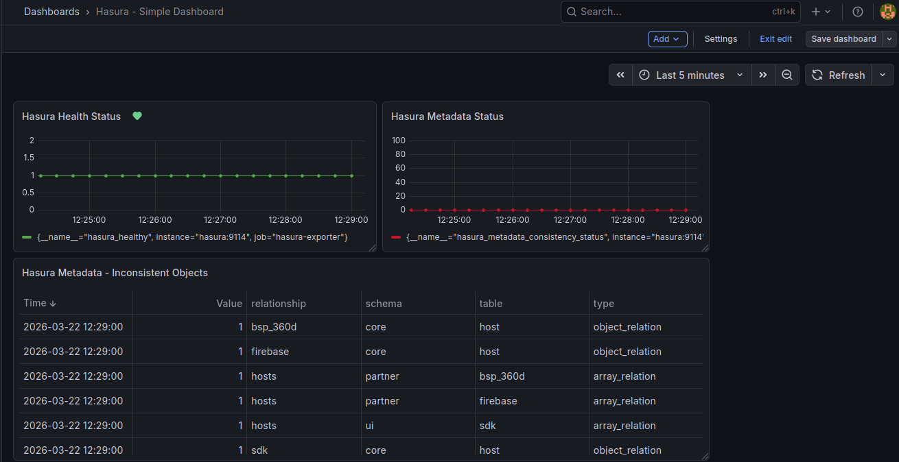

# Hasura Exporter



A lightweight Prometheus exporter for monitoring **Hasura GraphQL Engine** health and metadata consistency.

This exporter exposes basic but high-value metrics for detecting:

* Hasura availability
* Metadata consistency issues
* Specific inconsistent metadata objects (tables, relationships, etc.)

This works for any Hasura installation including the community edition.
---

## 🚀 Features

* ✅ Health check via `/healthz`
* ✅ Metadata consistency check via `/v1/metadata`
* ✅ Per-object inconsistency metrics with labels
* ✅ Prometheus-compatible `/metrics` endpoint

---

## 📊 Metrics Exposed

### 1. Hasura Health

```
hasura_healthy 1|0
```

| Value | Meaning        |
| ----- | -------------- |
| 1     | Hasura is up   |
| 0     | Hasura is down |

---

### 2. Metadata Consistency

```
hasura_metadata_consistency_status 1|0|-1
```

| Value | Meaning                        |
| ----- | ------------------------------ |
| 1     | Metadata is consistent         |
| 0     | Inconsistent metadata detected |
| -1    | Error while fetching metadata  |

---

### 3. Inconsistent Objects (Detailed)

```
hasura_metadata_inconsistent_object{type, schema, table, name, source} 1
```

Example:

```
hasura_metadata_inconsistent_object{type="object_relation",schema="core",table="host",name="firebase",source="default"} 1
```

Labels:

| Label  | Description                            |
| ------ | -------------------------------------- |
| type   | object_relation / array_relation / etc |
| schema | DB schema                              |
| table  | Table name                             |
| name   | Relation name                          |
| source | Hasura source                          |

---

## ⚙️ Configuration

Environment variables:

| Variable                      | Description               | Default                 |
| ----------------------------- | ------------------------- | ----------------------- |
| `HASURA_URL`                  | Hasura endpoint           | `http://localhost:8080` |
| `HASURA_GRAPHQL_ADMIN_SECRET` | Admin secret (required  ) | None                    |
| `PORT`                        | Exporter port             | `9114`                  |

---

## ▶️ Running

### Install dependencies

```
pip install -r requirements.txt
```

### Run exporter

```
python exporter.py
```

Exporter will be available at:

```
http://localhost:9114/metrics
```

Suggest to set this up as a system V user daemon. See below for a sample configuration.

---

## 🔍 Example Output

```
hasura_healthy 1
hasura_metadata_consistency_status 0

hasura_metadata_inconsistent_object{type="object_relation",schema="core",table="host",name="firebase",source="default"} 1
```

---

## 📡 Prometheus Configuration

Add to `prometheus.yml`:

```yaml
scrape_configs:
  - job_name: hasura
    static_configs:
      - targets: ['localhost:9114']
```

---

## 🚨 Example Alerts

```yaml
- alert: HasuraDown
  expr: hasura_healthy == 0
  for: 1m

- alert: HasuraMetadataInconsistent
  expr: hasura_metadata_consistency_status == 0
  for: 5m

- alert: HasuraMetadataObjectIssue
  expr: hasura_metadata_inconsistent_object == 1
  for: 5m
```

---

## 📊 Grafana Usage (Recommended)

Use the included `grafana.json` for a default dashboard.

---

## System V user daemon

The simplest way to run this is as a System V user service.
Copy the following into the file `~/.config/systemd/user/hasura-exporter.service`.

```
[Unit]
Description=Run once after boot (user)

[Service]
Type=oneshot
Environment="HASURA_GRAPHQL_ADMIN_SECRET=<hasura admin secret>"
ExecStart=python3 <path>/exporter.py 2>/dev/null &

[Install]
WantedBy=default.target
```

Enable it.

```
systemctl --user daemon-reload
systemctl --user enable hasura-exporter.service
loginctl enable-linger $USER
```

Start it and check status.

```
systemctl --user start hasura_exporter.service
systemctl --user status hasura_exporter.service
```

---

## ⚠️ Notes

* Requires access to Hasura admin API (`/v1/metadata`)
* Admin secret is required for secured deployments
* Designed for **low-cardinality metrics** (safe for Prometheus)

---

## 📄 License

MIT 

